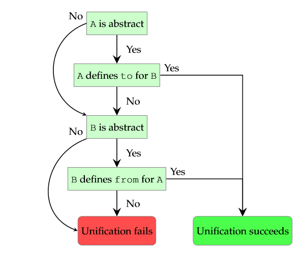

# 2.8.1.隐式类型转换

与类不同，抽象类型允许定义隐式转换。有两种类型的隐式转换：

**直接转换：** 允许抽象类型和其它类型之间的直接转换。这通过从或者往抽象类型添加规则来定义，而且只允许用于和抽象类型的潜在类型统一的类型。

**类字段：** 允许通过调用特别的转换函数进行转换。这些函数通过使用 `@:to` 和 `@:from` 元数据定义。这种类型的转换允许用于所有类型。

如下的代码示例展示直接转换的一个例子：

```haxe
abstract MyAbstract(Int) from Int to Int { 
    inline function new(i:Int) {
        this = i; 
    } 
} 

class Main {
    static public function main() {
        var a:MyAbstract = 12; 
        var b:Int = a; 
    }
} 
```

我们声明 `MyAbstract` 可以是从或者到 Int 类型，意思是它可以被用 Int 分配，并且可以分配到 Int 类型。这在第9和10行展示，第一个分配 Int `12` 到 `MyAbstract` 类型的变量 `a`（通过使用 `from Int` 声明 ），然后这个抽象类型分配回 Int 类型变量 `b`（通过使用 `to Int` 声明）。

另一种的类字段转换有相同的语义，但是定义完全不同：

```haxe
abstract MyAbstract(Int) { 
    inline function new(i:Int) {
        this = i;
    }
    @:from 
    static public function fromString(s:String) {
        return new MyAbstract(Std.parseInt(s)); 
    } 
    
    @:to 
    public function toArray() { 
        return [this]; 
    } 
} 

class Main { 
    static public function main() { 
        var a:MyAbstract = "3"; 
        var b:Array<Int> = a; 
        trace(b); // [3] 
    }
}
```

通过添加 `@:from` 到一个静态函数，这个函数获得资格作为从它的参数类型到抽象类型的隐式转换函数。这些函数必须返回一个抽象类型的值。它们还必须被声明为静态的 ：

类似的，添加 `@:to` 到一个函数，它获取资格作为从抽象类型到它的返回类型的隐式转换函数。这些函数通常是成员函数，但是它们可以被声明为静态 ，然后作为一个 [选择函数（第2.8.4节）](http:/#)。

在例子中，方法 `fromString` 允许分配值 “`3`” 到 `MyAbstract` 类型的变量 `a`，而方法 `toArray` 允许分配抽象类型到 `Array` 类型的变量 `b`。

当使用这种类型的转换，转换函数的调用被插入在需要的地方。当查看 JavaScript 输出的时候会很明显：

```haxe
var a = _ImplicitCastField.MyAbstract_Impl_.fromString("3"); 
var b = _ImplicitCastField.MyAbstract_Impl_.toArray(a); 
```

这可以被进一步优化，通过 [内联（第4.4.2节）](http:/#) 两种转换函数，使得输出如下：

```haxe
var a = Std.parseInt("3"); 
var b = [a]; 
```

当分配一个类型 A 到一个类型 B，并且至少它们中的一个为抽象类型时，选择的规则很简单：

- 1.如果 A 不是一个抽象类型，去到 3
- 2.如果 A 定义了一个允许到 B 的 `to` 转换，去到6
- 3.如果 B 不是一个抽象类型，去到 5
- 4.如果 B 定义一个允许到 A 的 `from` 转换，去到6
- 5.停止，统一失败
- 6.停止，统一成功



经过设计，隐式转换不被传递，就像下面的例子展示的：

```haxe
abstract A(Int) { 
    public function new() this = 0; 
    @:to public function toB() return new B(); 
} 

abstract B(Int) {
    public function new() this = 0; 
    @:to public function toC() return new C(); 
}

abstract C(Int) { 
    public function new() this = 0; 
} 

class Main { 
    static public function main() { 
        var a = new A(); 
        var b:B = a; // valid, uses A.toB 
        var c:C = b; // valid, uses B.toC 
        var c:C = a; // error, A should be C 
    } 
} 
```

虽然从 A 到 B 的转换和从 B 到 C 的转换分别是允许的，而一个传递的从 A 到 C 的转换则不允许。这是为了避免不明确的转换路径，并保持一个简单的选择规则。


------


Unlike classes, abstracts allow defining implicit casts. There are two kinds of implicit casts:

- Direct: Allows direct casting of the abstract type to or from another type. This is defined by adding `to` and `from` rules to the abstract type and is only allowed for types which unify with the underlying type of the abstract.
- Class field: Allows casting via calls to special cast functions. These functions are defined using `@:to` and `@:from` metadata. This kind of cast is allowed for all types.

The following code example shows an example of **direct** casting:

```haxe
abstract MyAbstract(Int) from Int to Int {
  inline function new(i:Int) {
    this = i;
  }
}

class Main {
  static public function main() {
    var a:MyAbstract = 12;
    var b:Int = a;
  }
}
```

We declare `MyAbstract` as being `from Int` and `to Int`, appropriately meaning it can be assigned from `Int` and assigned to `Int`. This is shown in lines 9 and 10, where we first assign the `Int` `12` to variable `a` of type `MyAbstract` (this works due to the `from Int` declaration) and then that abstract back to variable `b` of type `Int` (this works due to the `to Int` declaration).

Class field casts have the same semantics, but are defined completely differently:

```haxe
abstract MyAbstract(Int) {
  inline function new(i:Int) {
    this = i;
  }

  @:from
  static public function fromString(s:String) {
    return new MyAbstract(Std.parseInt(s));
  }

  @:to
  public function toArray() {
    return [this];
  }
}

class Main {
  static public function main() {
    var a:MyAbstract = "3";
    var b:Array<Int> = a;
    trace(b); // [3]
  }
}
```

By adding `@:from` to a static function, that function qualifies as an implicit cast function from its argument type to the abstract. These functions must return a value of the abstract type. They must also be declared `static`.

Similarly, adding `@:to` to a function qualifies it as implicit cast function from the abstract to its return type.

In the previous example, the method `fromString` allows the assignment of value `"3"` to variable `a` of type `MyAbstract` while the method `toArray` allows assigning that abstract to variable `b` of type `Array<Int>`.

When using this kind of cast, calls to the cast functions are inserted where required. This becomes obvious when looking at the JavaScript output:

```haxe
var a = _ImplicitCastField.MyAbstract_Impl_.fromString("3");
var b = _ImplicitCastField.MyAbstract_Impl_.toArray(a);
```

This can be further optimized by [inlining](https://haxe.org/manual/class-field-inline.html) both cast functions, turning the output into the following:

```haxe
var a = Std.parseInt("3");
var b = [a];
```

The **selection algorithm** when assigning a type `A` to a type `B` where at least one is an abstract is simple:

1. If `A` is not an abstract, go to 3.
2. If `A` defines a **to**-conversion that admits `B`, go to 6.
3. If `B` is not an abstract, go to 5.
4. If `B` defines a **from**-conversion that admits `A`, go to 6.
5. Stop, unification fails.
6. Stop, unification succeeds.


By design, implicit casts are **not transitive**, as the following example shows:

```haxe
abstract A(Int) {
  public function new()
    this = 0;

  @:to public function toB() return new B();
}

abstract B(Int) {
  public function new()
    this = 0;

  @:to public function toC() return new C();
}

abstract C(Int) {
  public function new()
    this = 0;
}

class Main {
  static public function main() {
    var a = new A();
    var b:B = a; // valid, uses A.toB
    var c:C = b; // valid, uses B.toC
    var c:C = a; // error, A should be C
  }
}
```

While the individual casts from `A` to `B` and from `B` to `C` are allowed, a transitive cast from `A` to `C` is not. This is to avoid ambiguous cast paths and retain a simple selection algorithm.