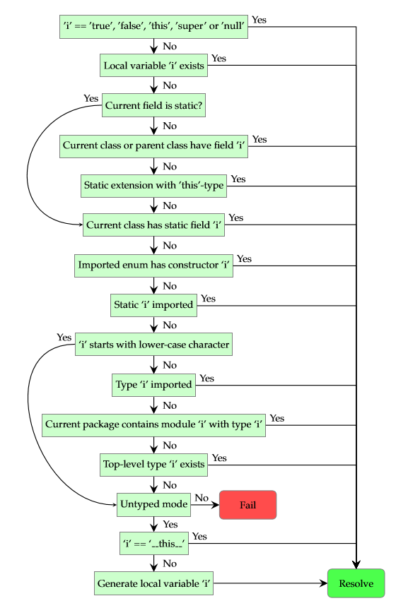

# 3.7.3.解析顺序

解析顺序一被引入就涉及到不受限制的标识符 。如 foo()，foo=1，foo.field等这些是表达式（第5章）。特别是最后一个包括类似 haxe.ds.StringMap的模块路径，haxe是一个绝对的标识符。

> Resolution order comes into play as soon as unqualified identifiers are involved. These are expressions(5)intheformoffoo(),foo = 1andfoo.field. The last one in particular includes module paths such as haxe.ds.StringMap, where haxe is an unqualified identifier.

我们描述解析顺序的算法，取决于以下的状态：

> We describe the resolution order algorithm here, which depends on the following state:

- 声明的局部变量（第5.10节）（包括函数参数）
- 导入（第3.7.2节）的模块，类型和静态字段
- 可用的静态扩展（第6.3节）
- 当前字段的种类（static或者成员）
- 当前类及其父类声明的成员字段
- 当前类声明的静态字段
- 预期的类型（第3.6.1节）
- untyped或者不是untyped的表达式

> - the declared local variables (5.10) (including function arguments)
> - the imported (3.7.2) modules, types and statics
> - the available static extensions (6.3)
> - the kind (static or member) of the current field
> - the declared member fields on the current class and its parent classes
> - the declared static fields on the current class
> - the expected type (3.6.1)
> - the expression being untyped or not

给定一个标识符 i ，算法规则如下：

> Given an identifier i, the algorithm is as follows:

1. 如果i 是true，false，this，super或者null，解析到匹配的 常量并停止
2. 如果一个局部变量命名为 i为可访问的，解析它并停止
3. 如果当前的字段是静态的，跳到6
4. 如果当前的类或者任何它的父类有一个字段命名为 i，解析到它并停止
5. 如果一个静态扩展带有第一个当前类类型的参数可用，解析到它并停止
6. 如果当前的类有一个静态字段命名为 i，解析到它并停止
7. 如果一个枚举构造函数命名为i声明在一个导入的枚举，解析到它并停止
8. 如果一个静态方法 i 被显式导入，解析到它并停止
9. 如果i通过一个小写字母开始，跳到11
10. 如果类型名为 i 是可用的，解析到它并停止
11. 如果表达式不是 untyped模式，跳到14
12. 如果i和这个相等，解析到这个常量并停止
13. 产生一个局部变量命名为 i，解析到它并停止
14. 失败

> 1. If i is true, false, this, super or null, resolve to the matching constant and halt.
> 2. If a local variable named i is accessible, resolve to it and halt.
> 3. If the current field is static, go to 6.
> 4. If the current class or any of its parent classes has a field named i, resolve to it and halt.
> 5. If a static extension with a first argument of the type of the current class is available,resolve to it and halt.
> 6. If the current class has a static field named i, resolve to it and halt.
> 7. If an enum constructor named i is declared on an imported enum, resolve to it and halt.
> 8. If a static named i is explicitly imported, resolve to it and halt.
> 9. If i starts with a lower-case character, go to 11.
> 10. If a type named i is available, resolve to it and halt.
> 11. If the expression is not in untyped mode, go to 14
> 12. If i equals **this**, resolve to the this constant and halt.
> 13. Generate a local variable named i, resolve to it and halt.
> 14. Fail

对于第10步，也需要定义类型的解析顺序：

> For step 10, it is also necessary to define the resolution order of types:

1. 如果一个类型名为 i 被导入（直接或者作为模块的部分导入），解析到它并停止
2. 如果当前的包包含一个模块名为 i和类型名为i，解析到它并停止
3. 如果一个类型名为i在顶层可用，解析到它并停止
4. 失败

> 1. If a type named i is imported (directly or as part of a module), resolve to it and halt.
> 2. If the current package contains a module named i with a type named i, resolve to it and halt.
> 3. If a type named i is available at top-level, resolve to it and halt.
> 4. Fail

对于这个算法的第一步，和之前的第5部第7步，导入决议的顺序很重要：

> For step 1 of this algorithm as well as steps 5 and 7 of the previous one, the order of import resolution is important:

- 导入的模块和静态扩展从底部到头部检查，第一个匹配的被采用
- 在一个给定模块，类型从头至尾检查
- 对于导入，如果名字相同则为匹配
- 对于静态扩展（第6.3节），如果名字相同并且第一个参数统一（第3.5节）则为匹配。在一个给定类型中被用作静态扩展的字段从头至尾进行检查。

> - Imported modules and static extensions are checked from bottom to top with the first match being picked.
> - Within a given module, types are checked from top to bottom.
> - For imports, a match is made if the name equals.
> - For static extensions (6.3), a match is made if the name equals and the first argument unifies  (3.5). Within a given type being used as static extension, the fields are checked from top to bottom.

